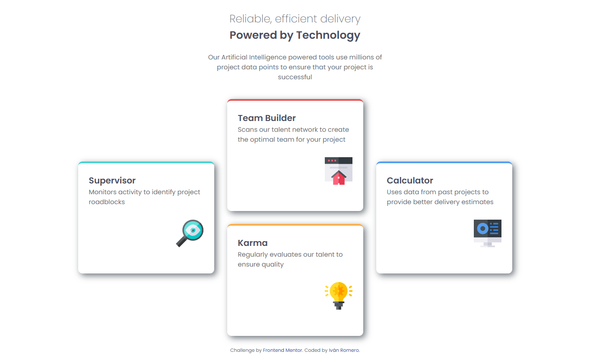

# Frontend Mentor - Four card feature section solution

This is a solution to the [Four card feature section challenge on Frontend Mentor](https://www.frontendmentor.io/challenges/four-card-feature-section-weK1eFYK). Frontend Mentor challenges help you improve your coding skills by building realistic projects. 

## Table of contents

- [Overview](#overview)
  - [The challenge](#the-challenge)
  - [Screenshot](#screenshot)
  - [Links](#links)
- [My process](#my-process)
  - [Built with](#built-with)
  - [What I learned](#what-i-learned)
  - [Continued development](#continued-development)
  - [Useful resources](#useful-resources)
- [Author](#author)

## Overview

### The challenge

Users should be able to:

- View the optimal layout for the site depending on their device's screen size

### Screenshot

### Links

- Solution URL: [Solution URL here](https://github.com/IvanRL-11/four-cards)
- Live Site URL: [Live site URL here](https://ivanrl-11.github.io/four-cards/)

## My process

### Built with

- Semantic HTML5 markup
- CSS custom properties
- Flexbox
- CSS Grid

### What I learned

Sigo practicando el uso de display flex y grid para lograr hacer diseños responsivos que se adapten a distitos dispositivos

### Continued development

Me gustaría seguir con el desarrollo usando las propiedades dd flexbox y grid, con el fin de poder brindar una gran experiencia con diseños responsivos sin importar el dispositivo desde el cual accedan.

### Useful resources

- [Grid Garden](https://cssgridgarden.com/#es) - Este juego recomendado por Frontend Mentor me ayudo a entender mejor el uso de grid

## Author

- GitHub - [IvanRL-11](https://github.com/IvanRL-11)
- Frontend Mentor - [IvanRL-11](https://www.frontendmentor.io/profile/IvanRL-11)

